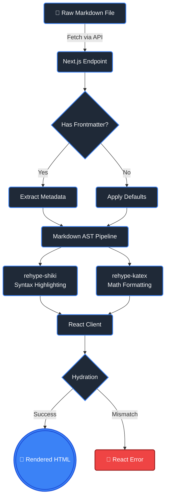

# Nid-Notes Comprehensive Showcase

Welcome to the ultimate test document. This file acts as a stress-test and visual sandbox for every feature supported by the **Nid-Notes** rendering engine. 

Below you will find interactive examples of GitHub Flavored Markdown (GFM), advanced code highlighting, mathematics, diagrams, and callouts.

---

## 1. Advanced Architecture Diagrams

Nid-Notes supports full client-side parsing of **Mermaid.js**. Here is a complex state machine diagram modeling the parsing lifecycle:



## 2. Mathematics Engine (KaTeX)

Native LaTeX support is built directly into the parser. You can write simple mathematical equations inline, such as Euler's formula: $e^{i\pi} + 1 = 0$, or standard quadratic forms $x = \frac{-b \pm \sqrt{b^2-4ac}}{2a}$.

When you need block-level formatting for complex theorems or probability theory, use the double-dollar syntax:

$$
\mathcal{L}_{ELBO}(\phi, \theta) = \mathbb{E}_{q_\phi(z|x)}\left[ \log p_\theta(x|z) \right] - D_{KL}\left( q_\phi(z|x) \| p_\theta(z) \right)
$$

## 3. Custom Obsidian-Style Callouts

If you need to draw attention to specific sections of your notes, use the built-in admonition blocks.

> [!NOTE]
> **Information Box**
> 
> This is a standard note block. It's excellent for outlining background context or providing general supplementary details to the reader.

> [!TIP]
> **Pro Tip**
> 
> Use the hotkey `Cmd/Ctrl + K` at any time to open the global search modal and jump to a different file instantly!

> [!WARNING]
> **Deprecation Notice**
> 
> Avoid writing `.log` data into this folder, as the `getNotesTree` parser expects recursive `.md` files.

> [!DANGER]
> **Critical Infrastructure**
> 
> Deleting the `src/app/api/compile` route will permanently break the live Markdown preview functionality in the Editor Pane!

## 4. Code and Syntax Highlighting

Thanks to **Shiki**, all code chunks are gracefully highlighted right off the server using high-performance tokenization.

```tsx
import React, { useEffect, useState } from 'react';
import { useApp } from '@/context/AppContext';

export default function LoadingExample() {
  const { isEditing } = useApp();
  const [ready, setReady] = useState<boolean>(false);

  useEffect(() => {
    // Artificial heavy lifting
    const hash = crypto.randomUUID();
    console.log(`Initialized editing session: ${hash}`);
    setReady(isEditing);
  }, [isEditing]);

  return ready ? <div>Launch sequence ready.</div> : null;
}
```

```python
def compute_fizzbuzz(n: int) -> list[str]:
    """An overly complex python solution."""
    return ["Fizz" * (i % 3 == 0) + "Buzz" * (i % 5 == 0) or str(i) for i in range(1, n + 1)]
```

## 5. Rich GitHub Flavored Markdown (GFM)

### Tabular Formatting
Standard markdown tables are instantly mapped and rendered with custom CSS.

| Framework | Rendering | Philosophy | Difficulty |
| :--- | :---: | :---: | ---: |
| **Next.js** | Server & Client | Full-stack robust apps | Medium |
| **Vite / React** | Client-side SPA | Fast, lightweight SPAs | Low |
| **Astro** | Server (Islands) | Content-heavy fast sites | Varies |

### General Typography Features
- You can add ~~strikethrough text~~ easily.
- Support for inline `code snippets`.
- URLs become links automatically: https://github.com

### Task Tracking
- [x] Integrate standard Unified mapping
- [x] Configure Shiki tokenization
- [x] Map Mermaid state diagrams
- [ ] Connect database persistence layer

---
*Created automatically for testing Nid-Notes rendering rules.*
